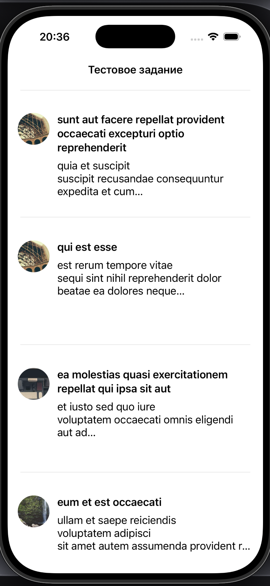
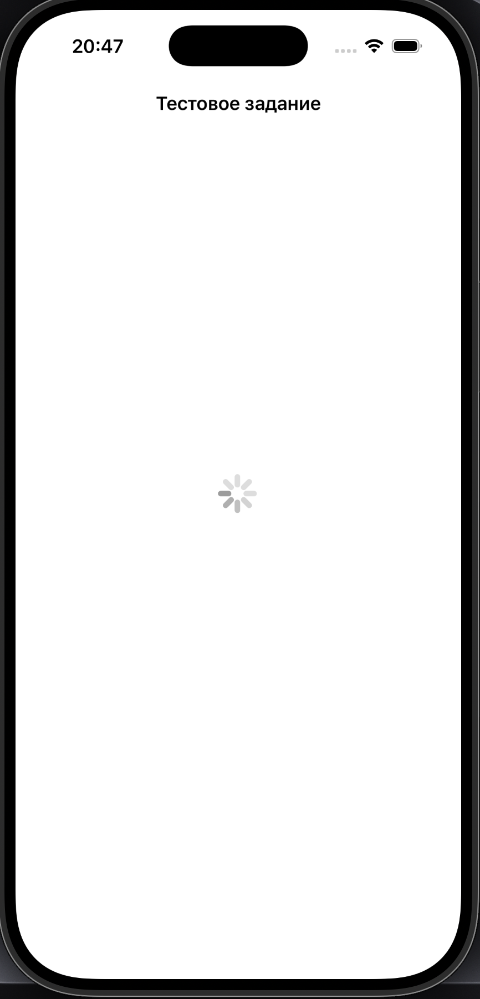
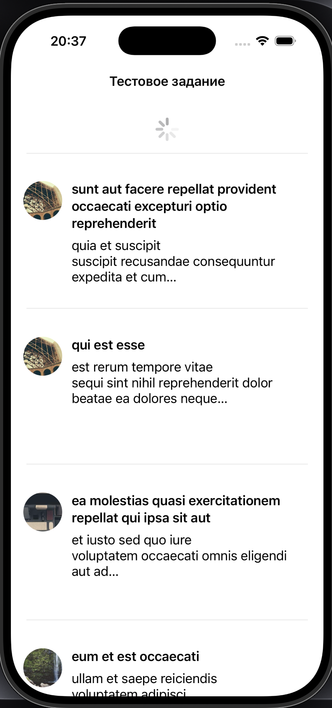
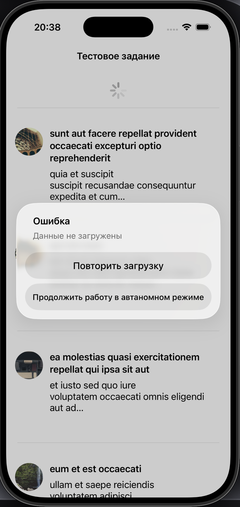

# TestiOSApp

Тестовое задание

## Скриншоты

<p align="center">
  
  
  
  
</p>

## Архитектура

Проект построен на **MVVM**:
```
TestiOSApp/
├── Models/
│   └── Item.swift              # Модель данных поста
├── ViewModels/
│   └── ViewModel.swift         # Бизнес-логика, связь View и данных
├── Views/
│   ├── MainViewController.swift    # Главный экран с таблицей
│   └── cells/
│       └── UserTableViewCell.swift # Кастомная ячейка таблицы
├── Network/
│   ├── NetworkService.swift    # Сетевой слой (URLSession)
│   └── Endpoint.swift          # Enum с URL-адресами API
└── CoreData/
    └── StorageManager.swift    # Менеджер работы с CoreData
```

## Функциональность

- ✅ Загрузка постов через JSONPlaceholder API
- ✅ Отображение постов в UITableView
- ✅ Аватары через Lorem Picsum
- ✅ Сохранение постов в CoreData для оффлайн-доступа
- ✅ Pull-to-refresh для обновления ленты
- ✅ Обработка ошибок с возможностью повторной загрузки или работы оффлайн

## Технологии

| Компонент | Технология |
|-----------|------------|
| Язык | Swift 5 |
| UI | UIKit + AutoLayout (программно) |
| Архитектура | MVVM |
| Сеть | URLSession |
| Изображения | Kingfisher |
| Хранилище | CoreData |

## Сборка и запуск

1. Клонируйте репозиторий:
```bash
git clone https://github.com/KoLili12/TestiOSApp.git
```

2. Откройте проект в Xcode:
```bash
cd TestiOSApp
open TestiOSApp.xcodeproj
```
